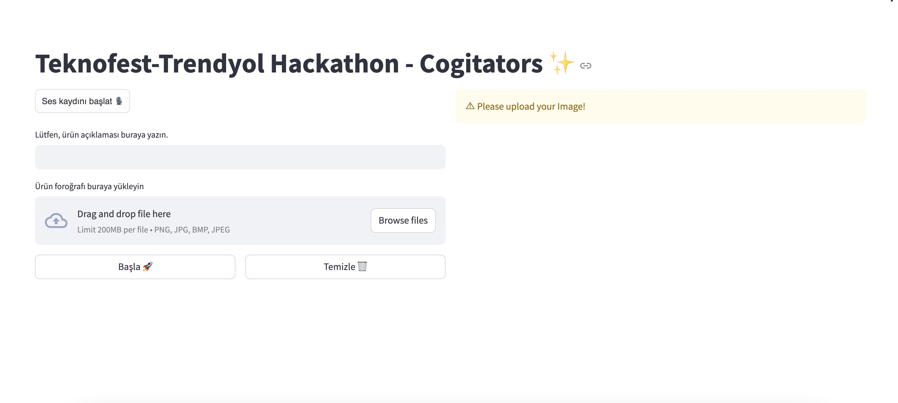
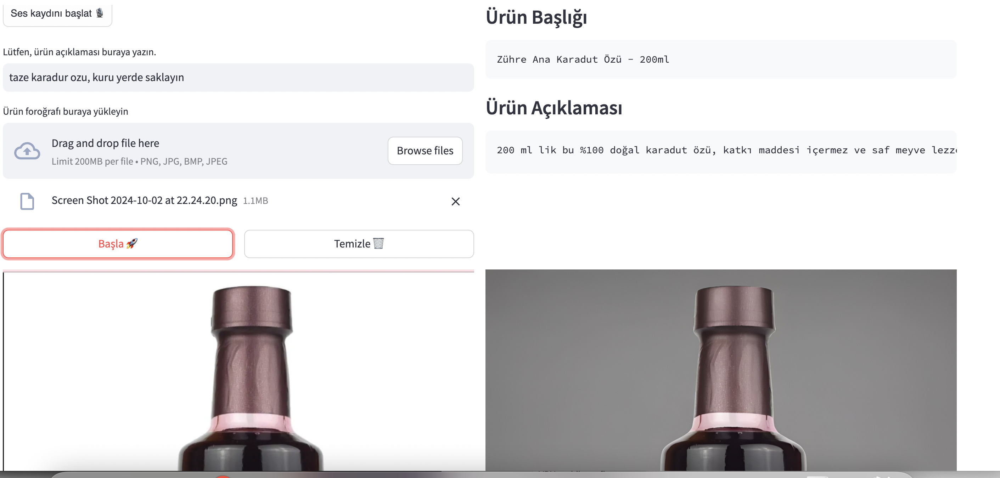

# Trendyol E-TICARET HACKATHON - Cogigators

Uygulamanın demo'su [buradan](https://drive.google.com/file/d/1I2gzIf9gCa604z16SxNQbF4njK_opq1A/view?usp=sharing) izleyebilirsiniz

# Installing the app
```
python3 -m venv mvenv
source mvenv/bin/activate
pip install -U pip
pip install -r requirements.txt
```

# Running the app
```
cd app
streamlit run app.py
```

If you are running the app in a cloud environement make sure to create a tunel to access the streamlit app:
```
npx localtunnel —-port 8501
```
Then paste the puplic url (without the port number) into the passcode requested.


Or you can use ngrok to create a tunnel. You need to authenticate using your access token from ngrok and then you can run:
```
ngrok http 8501
```


# UI Examples

The user can enter an intial descirption and upload a picture:


Then the enhanced image and a descriptionn is generated:

